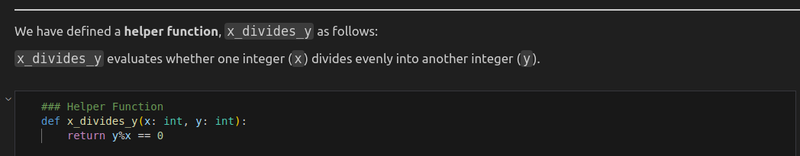
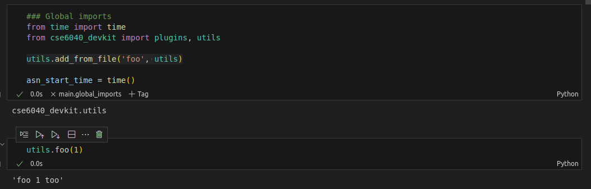

# Defining functions to include in the notebook

The `AssignmentBlueprint` has two ways to define functions and make them available in `main.ipynb`. If you want to include the source code, register a "helper" function. If not, register a "util" function.  

## Helper functions

Most of the time if we want students to call a function the instructors wrote, the function source should be available to them. The exceptions would be if the function definition disrupts the flow or isn't providing instructional value.  

The helper function code and docstring are included directly in the notebook.

### Python Helper Example
We use the `register_helper` decorator to register a helper function. A solution must exist for the same `ex_name` for the helper to render.

```python
@bp.register_helper(ex_name='fizzbuzz')
def x_divides_y(x: int, y: int):
    """`x_divides_y` evaluates whether one integer (`x`) divides evenly into another integer (`y`).
    """
    return y%x == 0
```

### Example Helper output



## Util functions

It's often useful to have utility functions that we call but don't expect students to call themselves. Unless there is value in sharing the source with students, we generally don't want to include it in the notebook.

The util function is serialized and imported into the notebook. If it is desired for the student to use the utility an explanation should be added.

### Python Util Example

We use the `register_util` decorator to register a util. The util is available globally following the global imports.  

```python
@bp.register_util()
def foo(arg: str) -> str:
    return f'foo {arg} too'
```

### Example Util output


