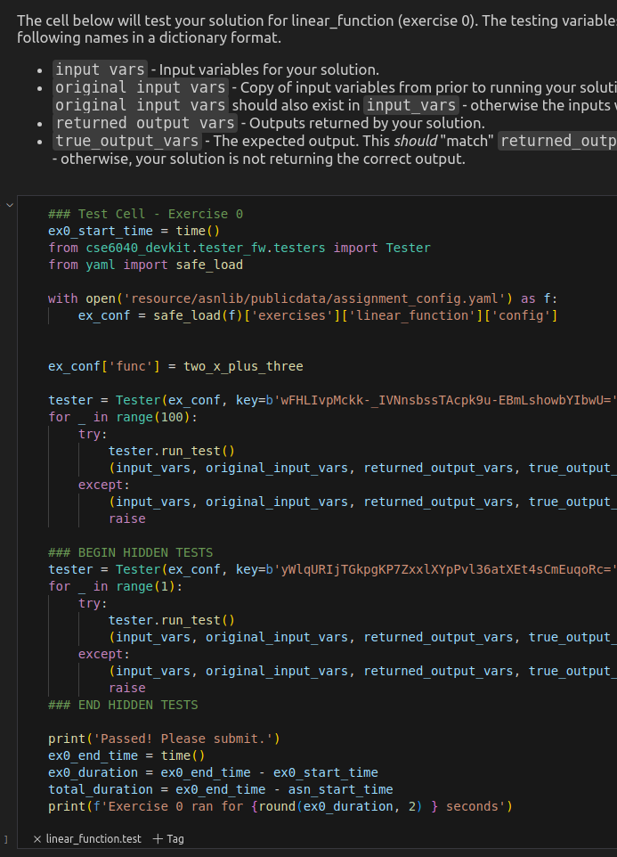

# Register a sampler for an exercise test

Next, we will update our assignment by registering an exercise sampler to the AssignmentBuilder using the `builder.register_sampler` decorator.

## Code

```python
from cse6040_devkit.assignment import AssignmentBuilder

builder = AssignmentBuilder()

@builder.register_solution('linear_function')
def two_x_plus_three(x: int)->int:
    ...

@builder.register_sampler(ex_name='linear_function',
                          sol_func=two_x_plus_three,
                          n_cases=100,
                          output_names='result')
def random_x():
    from random import randint
    return {'x': randint(-1000, 1000)}

from random import seed
seed('CSE 6040')

builder.build()
```

## Explanation

- The decorator `@builder.register_sampler` identifies the function defined below it as the **sampler** for the exercise named 'linear_function' (`ex_name`).  
- When `builder.build()` is executed the sampler function is used to generate 100 (`n_cases`) test cases with the output being named 'result'.
- The random seed is set **outside the sampler function definition** and before the `builder.build` call to produce consistent test cases between builds.

### Sampler function requirements

The solution function should meet these criteria:

- Takes no arguments  
- Returns a dict mapping each parameter name from the solution function to a random value.
- See the `test_case` module [README](test_case.md#requirements-for-sampler_func) for more details.

## main.ipynb

   

The test cell is now populated with a bunch of code that will test the students solution.

## Project files

```bash
├── assignment_definition.py
├── keys.dill
├── main.ipynb
└── resource
    └── asnlib
        └── publicdata
            ├── assignment_config.yaml
            ├── encrypted
            │   └── tc_linear_function
            └── tc_linear_function
```

Adding the sampler created `tc_linear_function` in both the `publicdata` and `encrypted` directories. These are used by the code in the test cells to evaluate the exercise solution.