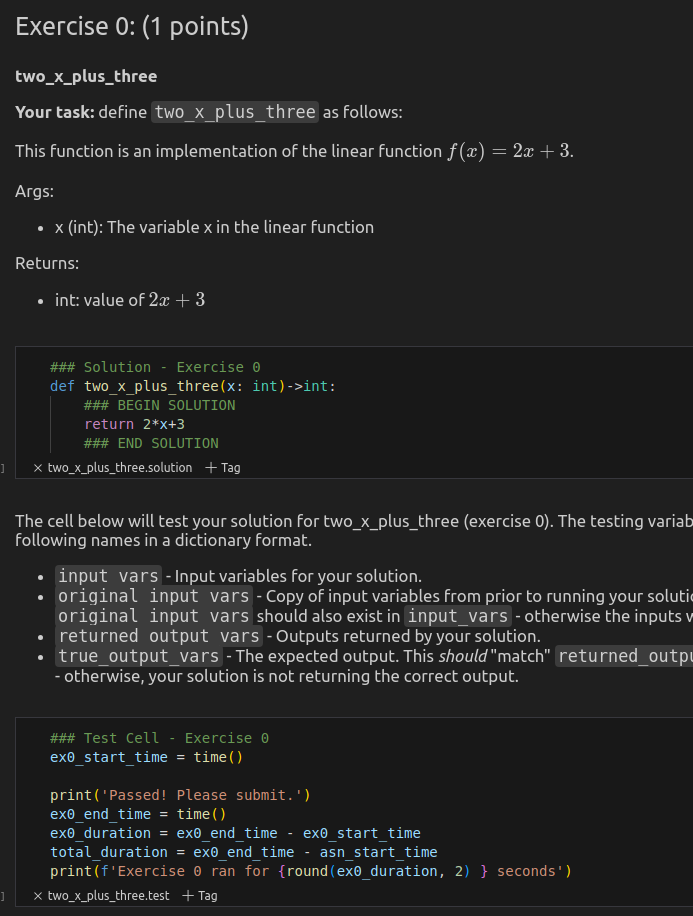

# Register an exercise solution

Next, we will update our assignment by registering an exercise solution to the AssignmentBuilder using the `builder.register_solution` decorator.

## Code

```python
from cse6040_devkit.assignment import AssignmentBuilder

builder = AssignmentBuilder()

@builder.register_solution('two_x_plus_three')
def two_x_plus_three(x: int)->int:
    """This function is an implementation of the linear function $f(x) = 2x + 3$.

Inputs:
- x (int): The variable x in the linear function

Outputs:
- int: value of $2x+3$
    """
    ### BEGIN SOLUTION
    return 2*x+3
    ### END SOLUTION

builder.build()
```

## Explanation

- The decorator `@builder.register_solution('two_x_plus_three')` identifies the function defined below it as the **solution** to the exercise named 'two_x_plus_three'.  
- When `builder.build()` is executed `main.ipynb` is updated with the function body and docstring from the solution function.

### Solution function requirements

The solution function should meet these criteria:

- output is deterministic based on the inputs  
- inputs and outputs are serializable
- function is not expected to raise errors during execution

If a function does not meet these criteria there is flexibility to possibly include it with plugins. There are several built-in plugins for common use-cases and functionality to register your own plugins. That process is covered in [Plugins](docs/plugins.md).

## main.ipynb

   

A prompt, solution, test explanation, and test were created.  
